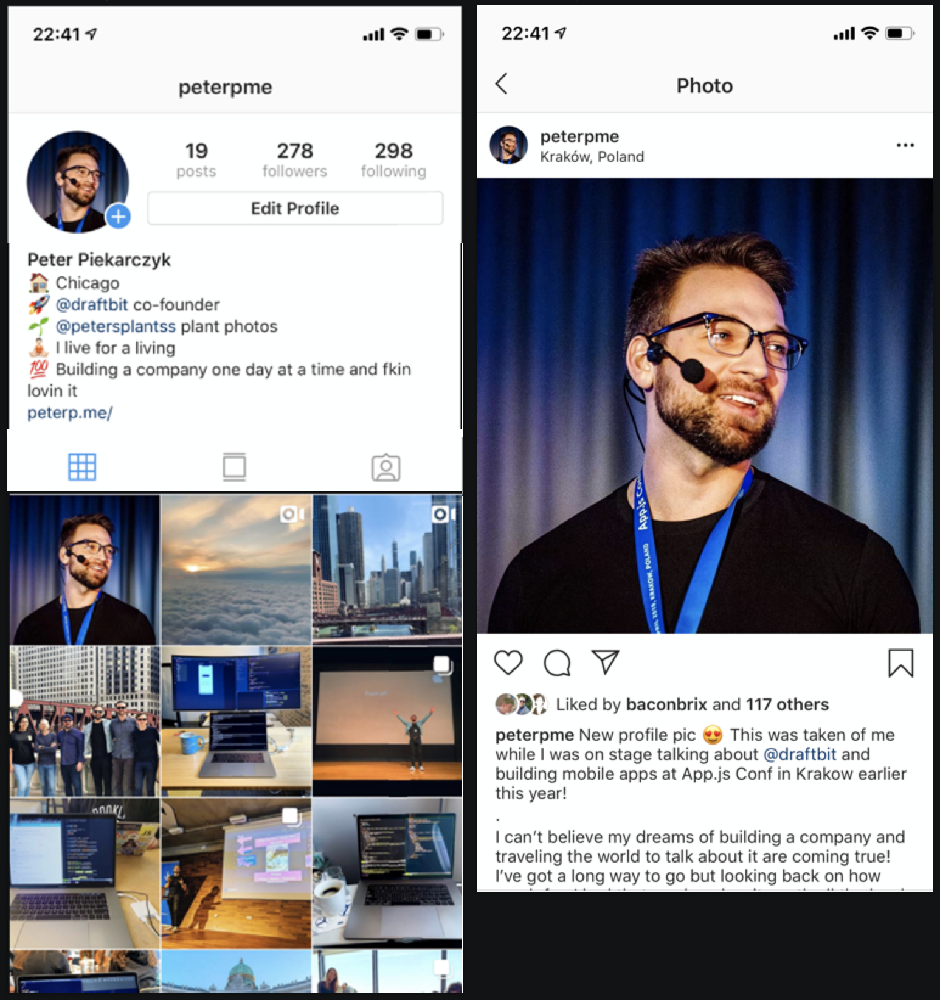

# Draftbit Interview Project: InstaClone



## Objective

Your challenge is to recreate a simple version of the Instagram profile experience. You have up to 4 hours to complete. The goal of this project is to figure out how you think about data, navigation and layout.

The experience should include the layout and navigating to a detail page. None of the other buttons need to do anything, but they should be treated as buttons.

You should not hard-code the data. The data can come from a json file, rest or graphql. Implementation is up to you. You shouldn't use the Instagram API

## Hints
- If you've never built a RN / Expo app, you should download the [Expo Client](https://expo.io/tools). This will make it A LOT easier for you to develop faster.
- In the profile image, you don't need to include the small blue circle with the "+".
- The bio / description area can be free text. The example in the screenshot as text that turn into links or tags, you don't need to worry about that.
- This does not need to be pixel perfect
- You can use the Unsplash API to pull in a variety of random photos
- No authentication / session is required. Just these two screens
- Don't use the Instagram API. It probably doesn't even work.

## Resources
- [React Native Components](https://facebook.github.io/react-native/docs/components-and-apis)
- [Expo](https://docs.expo.io/versions/latest/)
- [Expo tools](https://expo.io/tools)

## Instructions

- Install expo cli:

```
npm install expo-cli --global
```

- Install dependencies

```
npm install
```

- start the environment

```
npm start
```

If you use yarn, you know the drill!
